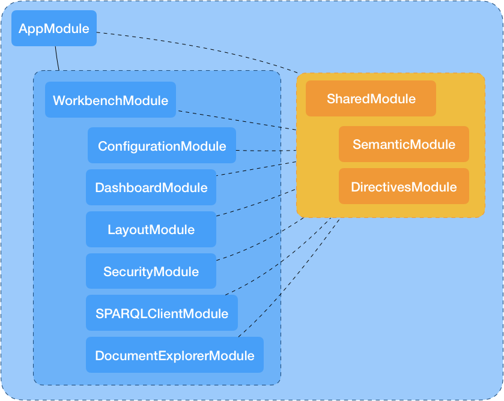

# Workbench's Structure

This project's structure can be divided in two parts: the configuration and
the application.

## Configuration Structure

In order for Webpack to produce its bundled version for Development or
Production environments we have to define what will be the values of our
Carbon LDP instance in each specific environment.

To do this, the folder called `config` located in the root of the project
contains the following files:

    .
    └── config                              # Configuration files used while bundling the application
        ├── dev
        │   ├── dev.config.json             # Settings used during DEVELOPMENT mode of the application
        │   └── webpack.dev.js              # Webpack's bundling settings for DEVELOPMENT mode
        ├── prod
        │   ├── prod.config.json            # Settings used during PRODUCTION mode of the application
        │   └── webpack.prod.js             # Webpack's bundling settings for PRODUCTION mode
        ├── test
        │   ├── karma.conf.js               # Settings for Karma
        │   ├── karma-test-shim.js          # Shims required by Karma to start run the tests
        │   └── webpack-test-shim.js        # Webpack's settings used by TEST mode
        ├── head.config.js                  # Contains the links that are going to be added to the index.html
        ├── webpack.common.js               # Webpack's settings used by DEV and PROD modes
        └── webpack.helpers.js              # Helpers used by webpack's webpack.common/dev/prod.js files

The files above are exclusively used by Webpack to bundle
correctly the files needed to produce the bundled version of the app for
the chosen environment (dev or prod).

### Global variables and `src/index.html`

Since the Workbench is shipped vía Docker images, when creating a
container using that image there are some Global variables that we can
set. These variables specify the domain and the protocol of the
Carbon LDP instance with which the Workbench is going to work.

Those variables are `CARBON_HOST` and `CARBON_PROTOCOL` and when passing
them as arguments to build the image, the script in charge of generating
the Docker image will run a script called `write-global-variables.sh`,
which is located inside the `scripts` folder.
What this script does is the replacement of some variables located
in the `src/index.html` file with the values passed with the `CARBON_HOST`
and `CARBON_PROTOCOL` arguments.
Thanks to this replacement, when the `/src/app/config.ts` reads the Global
variables from the `index.html` file, the values of the variables from
the `config.ts` file will be set to those values passed as arguments,
allowing us to initialize the Carbon LDP object with the protocol and
domain passed as arguments.

## Application Structure

### Transpilers

`tsconfig.json`

Since the Workbench is a web app using Angular, one of the requirements
of this framework is to use Typescript to write the angular components,
services, pipes, etc. In order for Webpack to understand typescript and
transpile it into JavaScript a config file with settings to transpile
ts code into js code is needed. This file is called `tsconfig.json` and
states which files are going to be included to transpile as well to
state the excluded folders for transpilation.

### Angular application

The whole Workbench angular app is located inside the `./src/app` folder.
In there we have _providers_ and _modules_.

- Providers 
    - `carbonldp.provider.ts`: 
    This file exports two things: `CARBONLDP_PROVIDERS` and
    `carbonldpProvider` function. 
        - The `carbonldpProvider` function: 
            Returns an object that returns a promise with the initialized
            Carbon LDP variable to be used anywhere in our angular application. 
        - The `CARBONLDP_PROVIDERS`:
            Returns an [angular provider](https://angular.io/guide/providers)
            that allows us to inject the initialized Carbon LDP variable
            returned by the `carbonldpProvider` function in order to be injected
            into any angular component.

- Guards 
    - `abstract-authentication.guard.ts`: 
        This file is the _"parent"_ which the `AuthenticatedGuard` and the
        `NotAuthenticatedGuard` will extend. What it does is to check if
        the `AuthService`, in charge of handling the authenticated users,
        is ready.
    - `authenticated.guard.ts`: 
        Detects if a user is authenticated by using the `AuthService`
        inherited from the parent `AbstractAuthenticationGuard`.
    - `not-authenticated.guard.ts`: 
        Detects if a user is NOT authenticated by using the `AuthService`
        inherited from the parent `AbstractAuthenticationGuard`.

    
- Modules 
    Modules are the core of how angular tries delivers its features.
    An example of Angular provided modules are `FormsModule`, `BrowserModule`
    among others. Thanks to this way of providing logic-specific features,
    Angular enforces developers to follow this approach to provide
    logic-specific functionality through the use
    [NgModules](https://angular.io/guide/ngmodule-api), allowing
    developers to create custom made modules.

    The Workbench follows this approach and provides multiple functionality
    through many modules that make up the whole Workbench App.
    The Workbench includes the following modules:

    - AppModule: 
        This is the main or root module which contains the main AppComponent,
        some authentication features like Guards and authentication services.
        This is the bootstraped module used in `main.ts`, the entry point
        of every Angular app.

    - ConfigurationModule: 
        This is a remainder of old features the Workbench used to have.
        The module provided features to realize Backups of the platform's
        data as well to export and import backed data.

    - DashboardModule: 
        This module contains all the widgets used by the Dashboard section
        of the Workbench. This include some services and widgets that are
        displayed in the DashboardView.

    - DirectivesModule: 
        A module focused to provide directives that are being used by
        modules that import the `SharedModule`.

    - DocumentExplorerModule: 
        Provides the components necessary to display, modify and delete
        data/documents stored in the platform. Some of the components
        that make up this module are: DocumentTreeView, Lists, Literals,
        Pointers, NamedFragments, DocumentCreator, DocumentDeleter, among
        others.

    - LayoutModule: 
        Provides components that, together, create the layout of the
        Workbench. This means this module contains Headers, Sidebars and
        some services necessary to interact correctly with these components.

    - SPARQLClientModule: 
        Add functionality to create, save and run SPARQL queries and
        displaying the results.

    - SecurityModule: 
        This module contains all the necessary code to create, read, update
        and delete the Users and Roles of the platform.

    - SemanticModule: 
        Its purpose is to easily create Semantic UI components instead of
        using the syntax of the Semantic UI.

    - SharedModule: 
        A module that contains multiple directives, services and components
        that's being used by multiple modules hence the name `SharedModule`.

    - WorkbenchModule: 
        This is the module that imports all the modules that make up the
        Workbench. This module provides the main layout of the Workbench
        and renders all the routes on it.

    As stated in some modules, not all mode are a direct part of the
    `AppModule`, instead, they are part of other modules like the
    `SharedModule` or the `WorkbenchModule`.
    These modules can be classified in the following way:

    

### Architecture

A folder called architecture is included in this documentation. The goal
of this folder is to document the whole architecture of the Workbench,
meaning by architecture to an overview on how the Angular
application is structured in regards of how many Modules exists, what does
each module contain (Components, Pipes, Directives, etc) and what's the
current state of documented code.

#### Tasks for generating the architecture

- `compodoc`
    This command just generates the architecture folder.
- `compodoc:serve`
    This command calls the `compodoc` task and serves it through the
    port `4002`.
- `compodoc:watch`
    This command calls the `compodoc:serve` task and watches changes made
    to the Workbench's source code serving them through port `4002`.
